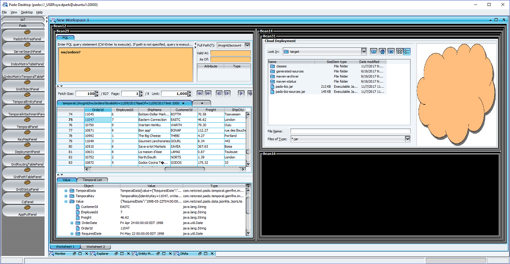

# Pado-web

Pado-web is a web container that provides the Pado RESTful API for invoking IBiz objects. 

## Installing pado-web
- Download and install Pado following the instructions in the Pado [README.md](https://github.com/netcrest/pado/tree/develop/README.md) file.
- Download and build pado-web as follows:
```
mvn clean package exec:exec -DskipTests
```
- Place the `target/pado-web-<version>.war` file in the app server's webapps directory. For example, for Tomcat, place it in `<tomcat-home>/webapps/`.
- Create a symbolic link to remove the version number from the directory name:
```
cd <tomcat-home>/webapps
ln -s pado-web-<version> pado-web
```
- Set the GemFire `locators` property in `<tomcat-home>/webapps/pado-web/WEB-INF/etc/client/pado.properties`. It is pre-configured to `localhost:20000`.
- Restart Tomcat.
- From your browser, enter `http://host:port/pado-web`. For example,
```
http://localhost:8080/pado-web
```

## Pado Desktop
Pado-web also includes Pado Desktop that can be launched from a web browser. Pado Desktop is a Swing-based GUI framework that provides three core services: *screen layout manager*, *component catalog*, and *persistence*. The screen layout manager allows the user to layout the screen during run-time. The component catalog provides access to visual components that can readily be dropped in the screen to create an app. The figure below shows the component catalog in the left pane and a workspace with two worksheets in the center pane. The worksheets can be divided into any number of quads. A quad is occupied by a single instance of a component selected from the component catalog. The final screen with all quads occupied by component instances becomes an app as shown in Figure 6. The persistence service stores the final screen in the local file system and/or in Pado, allowing each user to easily manage multiple visual apps.



Pado Desktop includes numerous UI components for browsing and monitoring data grids. It includes a template that has various UI components already laid out for your convenience. The template is persisted in the pado-web container and you can load it by selecting File/Open Template from Pado Desktop.

Pado Desktop can be launched as a standalone app or from a web browser via JNLP. Due to JNLP security limitations, Microsoft IE/Edge and Google Chrome dropped support for JNLP. **You must use Firefox or `javaws` (see next section) to launch Pado Desktop.** 

### Installing and Launching Pado Desktop
Once you have pado-web installed, click on the "Install Pado Desktop" link from the pado-web page, i.e., `http://host:port/pado-web`. This link provides instructions as to how to configure Java security for JNLP. Once Java security has been configured, click on the "Launch Pado Desktop" link.

Note that you can also run JNLP apps without the web browser by executing the included scripts: [desktop.sh](src/main/webapp/desktop.sh) and [desktop.bat](src/main/webapp/desktop.bat). These scripts use the `javaws` executable found in the JDK distribution to directly run Pado Desktop. They are located in the pado-web/desktop/ directory of `pado-web-<version>.war`.

## Pado RESTful API

The following core methods are supported in the form of RESTful API:

- Login
- Logout
- Catalog
- Query
- IBiz

*Note that Python client support provided by [**pado-rpc**](https://github.com/netcrest/pado/tree/develop/pado-rpc/README.md) relies on pado-web for invoking DNAs.*

### Login

#### Request
- method=login
- appid=`<Valid app ID, i.e., sys>`
- username=`<Valid user name>`
- password=`<User password>`

#### Response
- "token": "`<Session token if login successful>`"
- "status": `<Response status code. 0 if success>`
- "message": "`<Response message>`"

#### Example
Resquest:
```
http://localhost:8080/pado-web/pado?method=login&appid=sys&username=foo&password=yong
```
Response:
```
{	
	"gid":"mygrid",
	"message":"Login success",
    "token":"9f15cb39-7777-44de-9f2a-0faa27d8617b",
    "appid":"sys",
    "username":"foo",
    "status":0
}
```

### Logout
#### Request
- token=`<session token received from the login response>`
- method=logout

#### Response
- "token": "`<Session token>`"
- "status": `<Response status code. 0 if success>`
- "message": "`<Response message>`"

#### Example
Request:
```
http://localhost:8080/pado-web/pado?method=logout&token=9f15cb39-7777-44de-9f2a-0faa27d8617b
```
Response:
```
{
	"token":"9f15cb39-7777-44de-9f2a-0faa27d8617b",
	"method": "logout"
}
```

### Catalog
#### Request
- token=`<Session token>`
- method=catalog
- filter=`<Optional regular expression for filtering the catalog. If not specified then the entire catalog is returned.>`

#### Response
- "token": "`<Session token>`"
- "status": `<Response status code. 0 if success.>`
- "result": "`<A catalog of all IBiz objects allowed for the app ID.>`"

#### Example
Request:
```
http://localhost:8080/pado-web/pado?token=9f15cb39-7777-44de-9f2a-0faa27d8617b&method=catalog&filter=.*Temporal.*
```
Response:
```
{
  "catalog": [
    {
      "Name": "com.netcrest.pado.biz.ITemporalAdminBiz",
      "Methods": [
        {
          "Args": [
            {
              "Name": "java.util.Set",
              "Type": "java.util.Set",
              "IsRequired": true
            }
          ],
          "Return": {
            "Desc": null,
            "Type": "java.util.Map"
          },
          "Name": "getAll"
        },
        {
          "Return": {
            "Desc": null,
            "Type": "boolean"
          },
          "Name": "isEnabled"
        },
        . . .
  ],
  "message": "Catalog success",
  "token": "9f15cb39-7777-44de-9f2a-0faa27d8617b",
  "status": 0
}
```

### Query
#### Request
- query=`<Pado Query Language (PQL) string>>`
- validat=`<Valid-at time in date format "yyyyMMddHHmmssSSS">`
- asof=`<As-of time in date format of "yyyyMMddHHmmssSSS">`
- batch=`<Streamed batch size. Default: 100>`
- ascend=`<Ascending order flag. true to ascend, false to descend. Default: true>`
- orderby=`<Order-by field name>`
- refresh=`<true to refresh L2 result set. Default: false>`
- cursor=`<"next" to go to the next page (batch) of the result set. "prev" to go the previous page, a - numeric value to move the cursor to the result index position. If the result set is not available then the query is executed and the cursor is positioned at beginning of the result set.>`
- token=`<Session token obtained upon successful login>`

#### Response
- "size": `<Size of the returned result set>`
- "total": `<Total size of the result set>`
- "cursor": `<Current cursor position>`
- "token": "`<Session token>`"
- "status": `<Response status code. 0 if success.>`
- "message": "`<Response message. Used as status message.>`"
- "result": `<IBiz method returned value>`

#### Example
Request:
```
http://localhost:8080/pado-web/pado?token=9f15cb39-7777-44de-9f2a-0faa27d8617b&query=nw/orders?ShipCountry:France&cursor=next
```

Response:
```
{
  "cursor": 0,
  "token": "9435e378-f6e9-49c1-bb18-f12f02564db0",
  "total": 18,
  "size": 18,
    "result": [
    {
      "RequiredDate": "1997-02-21T05:00:00.000Z",
      "ShipName": "La maison d'Asie",
      "ShippedDate": "1997-02-14T05:00:00.000Z",
      "ShipCity": "Toulouse",
      "CustomerId": "LAMAI",
      "ShipVia": "2",
      "ShipPostalCode": "31000",
      "OrderId": "10425",
      "OrderDate": "1997-01-24T05:00:00.000Z",
      "ShipRegion": null,
      "ShipAddress": "1 rue Alsace-Lorraine",
      "ShipCountry": "France",
      "EmployeeId": "6",
      "Freight": "7.93"
    },
    . . .
}
```

### IBiz
#### Request
- ibiz=`<Fully-qualifying IBiz class name>`
- cargs=`<IBiz constructor arguments in JsonArray>`
- method=`<IBiz method name. Case sensitive>`
- args=`<Method arguments in JsonArray>`
- token=`<Session token obtained upon successful login>`

#### Response
- "token": "`<Session token>`"
- "status": `<Response status code. 0 if success.>`
- "message": "`<Response message. Used as status message.>`"
- "result": `<IBiz method returned value.>`

#### Example
Request:
```
http://localhost:8080/pado-web/pado?token=9f15cb39-7777-44de-9f2a-0faa27d8617b&ibiz=com.netcrest.pado.biz.IUtilBiz&method=getServerTime
```
Response:
```
{
  "token": "9f15cb39-7777-44de-9f2a-0faa27d8617b",
  "result": "2017-11-07T21:44:26.956Z",
  "status": 0
}
```
### RESTful ApI Limitations
The REST-to-IBiz translation mechanism has the following limitations. 
- Overloaded methods are not supported. If there are more than one method with the same name, then the method invocation will return an error message.
- Argument and return types are limited to the following types:
  - Primitives
  - String
  - JsonLite
  
### Best Practices
For providing a consistent RESTful API for your app, it is recommended that you should limit all IBiz argument and return types to JsonLite. This simplifies code maintenance and removes any ambiguities in the API. To assist developers and end users with API details, the Pado IBiz catalog service provides [IBizInfo](https://github.com/netcrest/pado/tree/develop/pado-core/src/main/java/com/netcrest/pado/IBizInfo.java) based details of IBiz classes and their methods. An IBizInfo class typically extends [SimpleBizInfo](https://github.com/netcrest/pado/tree/develop/pado-core/src/main/java/com/netcrest/pado/biz/info/SimpleBizInfo.java) and provides class and method details.